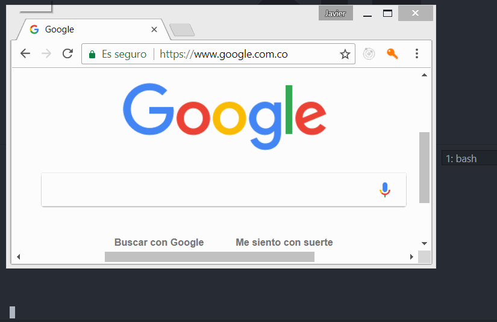
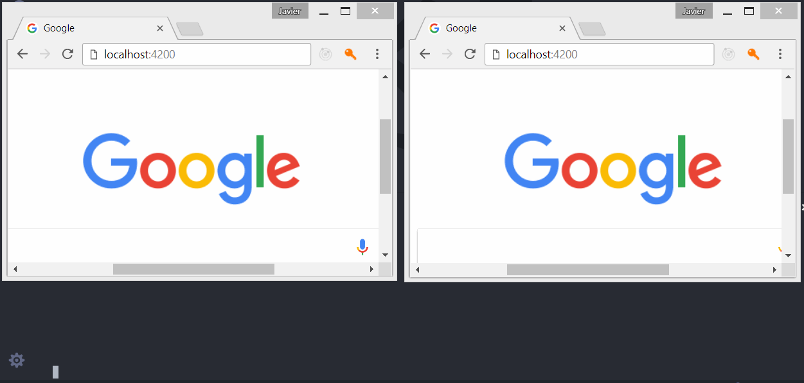

# BankAccount
Este proyecto fue generado con  [Angular CLI](https://github.com/angular/angular-cli) version 1.5.0.
Este proyecto pretende usar [socket.io](https://socket.io/) para el manejo de cuentas bancarias y convertirse en una aplicación en tiempo real. También utiliza el paradigma de [Redux](https://redux.js.org/) para Angular, también llamado [NgRx](https://github.com/ngrx/platform).

## Ejecutar servidor front-end
Ejecute el comando `ng serve` para desplegar el servidor cliente. En su navegador vaya a `http://localhost:4200/`. La aplicación se recargará automáticamente con cada cambio que se haga.

## Ejecutar servidor back-end
Ejecute el comando  `node server` para desplegar el servidor de backend. En su navegador vaya a `http://localhost:3000/`.  En la ruta principal se puede apreciar el mensaje `{"message":"Welcome to Bank Account"}`.

## Comportaiento de la aplicación
Ya que la aplicación utiliza `socket.io` es una aplicación que trabaja en tiempo real.  

El objetivo de esta aplicación es conectar clientes a la aplicación mediante socket y compartir información en tiempo real, la información que comparte es la creación de cuentas bancarias.

Esta aplicación utiliza el paradigma de `Redux` para angular o `NgRx`, el cual guarda toda la información en un store y recupera o modifica los datos mediante el `dispatch` de `actions`.

Al momento de crear una nueva cuenta, el cliente que la creo envía la información mediante socket a los otros clientes, las demás cuentas lo reciben y lo adicionan al store para evitar hacer `request` innecesarios, de esta manera se mantiene todos los clientes actualizados y en sincronía.

